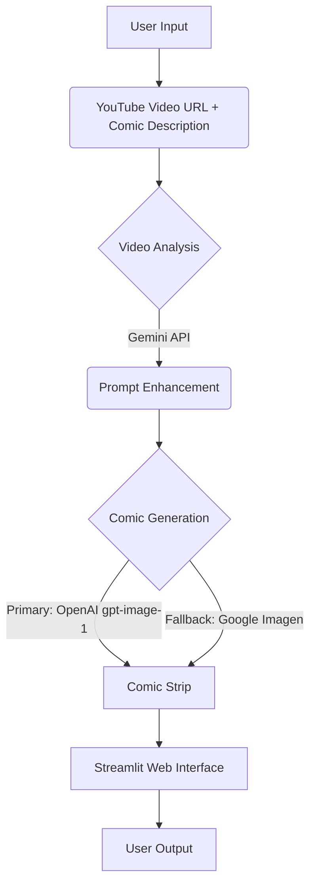

# Comic-AI ([🌐Live Demo](https://sannidhya-das-comic-ai.streamlit.app))


> Turn any YouTube video or uploaded video into a comic strip using AI! 🎨 Transform your favorite moments into shareable comic art with just a few clicks.
---
## 🌟 Features

- **Convert Videos to Comics**: Turn YouTube videos or uploaded videos into 4-panel comic strips
- **AI-Powered**: Uses advanced AI models (OpenAI + Google Imagen) to generate high-quality comics
- **Natural Language Prompts**: Describe your comic in plain English
- **Dual AI Engine**: Primary and fallback AI models for maximum reliability
- **Professional Quality**: High-resolution 1024×1024 comic strips
- **Easy to Use**: Simple web interface with Streamlit
- **Free & Open Source**: No cost for setup and deployment

## 🎥 Demo

### Input Video
[](https://www.youtube.com/watch?v=_AYnFtU56hE)

### Generated Comic


## 🔧 How It Works

1. **Video Analysis**: Uses Gemini AI to analyze video content and context
2. **Prompt Enhancement**: Transforms user descriptions into detailed AI prompts
3. **Comic Generation**: Generates comics using OpenAI's gpt-image-1 or Google's Imagen
4. **Fallback System**: Automatic fallback to secondary AI if primary fails
5. **Web Interface**: Streamlit-based UI for easy interaction
---
## 🚀 Getting Started

### 1️⃣ Prerequisites
- Python 3.8+
- YouTube video URL or video file
- API keys (see below)

### 2️⃣ Installation
Clone the repository
```bash
git clone https://github.com/SannidhyaDas/Comic-AI.git
cd Comic-AI
```
Create virtual environment (recommended)
```bash
python -m venv venv
source venv/bin/activate # On Windows: venv\Scripts\activate
```
Install dependencies
```bash
pip install -r requirements.txt
```

### 3️⃣ Configuration

1. Create a `.env` file in the project root:
```ini
GEMINI_API_KEY=your_gemini_api_key_here
OPENAI_API_KEY=your_openai_api_key_here
```

2. Get your API keys:
- **Gemini API Key**: [Google AI Studio](https://aistudio.google.com)
- **OpenAI API Key**: [OpenAI Platform](https://platform.openai.com)

### 4️⃣ Running the App

Run the Streamlit app
```bash
streamlit run app2.py
```
Open your browser to [http://localhost:8501](http://localhost:8501)
---

## 🛠️ Technical Architecture


---

## 📦 Project Structure

```bash
Comic-AI/
│
├── assets/                        # Streamlit web interface
│   ├── appInterface_1.png            # Yt video & prompt example 
│   ├── appInterface_2.png            # generated comic example 
│   └── generated_img1.png            # comic example 
│
├── v1/             # Gemini free image gen model
│   ├── requirements.txt            # Python dependencies
│   ├── main.py             # Core logic and LLM pipelines  
│   ├── example1.ipynb      # example with functions of main.py 
│   └── app.py              # Streamlit user interface
│
├── v2/              # paid models(OpenAI + Gemini Imagen) 
│   ├── requirements.txt            # Python dependencies
│   ├── main2.py             # Core logic and LLM pipelines
│   ├── example2.ipynb      # example with functions of main2.py 
│   └── app2.py              # Streamlit user interface
│
└── README.md                   # Project documentation

```
## 📌 Version Information

This repository contains two versions of the application:

### v1: Free Tier Implementation
- Uses `gemini-2.0-flash-preview-image-generation` (free image generation model)
- Limitations:
  - Text rendering quality is inconsistent
  - Image quality can be suboptimal
  - Text in speech bubbles may appear blurry or garbled

### v2: Premium Implementation
- Implements a fallback strategy using paid models:
  - Primary: OpenAI's `gpt-image-1` (superior text rendering)
  - Fallback: Google's `imagen-4.0-generate-001` (high-quality image generation)
- Benefits:
  - Significantly improved text clarity
  - Higher overall image quality
  - More reliable comic generation

The deployed version uses v1 due to the payment requirements of the premium models. However, the v2 code is fully functional - users only need to provide their own API keys and have active billing with the respective services to use the premium models.
 

---
## 📬 Contact

Sannidhya Das - [@LinkedIn](https://www.linkedin.com/in/sannidhya-das3/) - dassannidhya003@gmail.com

Project Link: [https://github.com/SannidhyaDas/Comic-AI](https://github.com/SannidhyaDas/Comic-AI)
